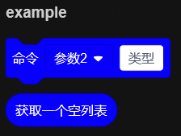

<div align="center">

# ⚡ turbowarp-ts-plugin

[中文](/README.md) | English
#### 📦 Turbowarp Development environment extension plugin

</div>

## Introduction
turbowarp-ts-plugin is a plugin for efficient development and deployment of turbowarp extensions, providing.
- ✨ **better interface style**
- 🔨 **Better development environment**
- 📦 **Autocomplete**
- 🌀 **webpack extreme size compression**
- 🎃 **Registration exception detection**
- 🎉 **Typescript support**

## Development
1. Initial installation of dependencies (**yarn** **pnpm** same, **pnpm** recommended)
    ```commandline
    npm install
    ```
2. import write extensions **/src/index.ts** (**javascript** same)
3. eslint fix
    ```commandline
   npm run lint
    ```
4. package generation
    ```commandline
    npm run build
    ```
The js file generated by **webpack** packaging is located in **dist/extension.js**

## Interface

**TurboWarp Extension Interface Specification** More go to [40code Extension Development Documentation](https://40code.com/#page=post&id=198)
1. `id` is a string that indicates the unique id used by this extension should contain only characters a-z and 0-9 **(the same extension should always use the same id, as changing it will break existing items)**
2. `name` is a string that tells Scratch what name to display in the sidebar
3. `color1` is a hex format color that will be set to the extension's square color
4. `blocks` is a list of objects that define which blocks the extension contains
    - `opcode` is the internal name of the block, which also corresponds to the method that will be called by default when the block is run *_(optionally `func` overrides the called method name, deprecated)_
        - **opcode should not be changed**
    - `blockType` defines the type of the block
        - `Scratch.BlockType.REPORTER` Round block with return value
        - `Scratch.BlockType.BOOLEAN` A hexagonal block that returns a boolean value
        - `Scratch.BlockType.COMMAND` A key block
    - `bind` accepts a **function**, allowing asynchronous execution to return a Promise
    - `text` is a string that defines the name of the block in the editor in the format **[parameter:type]**
        - `parameters` defines the objects that the building block accepts as parameters, possibly referenced in the `default` and `menu` fields
        - `TYPE` defines the input shape to be created *(case-insensitive)*
            - `STRING` string type
            - `NUMBER` for numeric input
            - `BOOLEAN` for boolean input **(default values will be ignored)**
            - `ANGLE` for angle
            - `COLOR` for color type (hex format, *e.g. #fff*)
            - `MATRIX` 5x5 matrix (passed in 111101010101... string format)
            - `NOTE` is used for music
    - `default` is the initial value of the parameter, accepts a dictionary, the key corresponds to the `parameter`, the value corresponds to the `default` value of the parameter
    - `menu` can be added to this parameter if there are parameters to select more than one given value, accepts a dictionary, key corresponds to `parameter`, value corresponds to the list type of more than one given value, will generate a drop-down menu
    - `disableMonitor` if or not the block forces to remove the checkbox to create a monitor, applicable type is **REPORTER** *(block with return value)*, if true, then remove the checkbox to the left of the variable
5. `docsURI` corresponds to document link

Don't quite get it? Here's an example
```typescript
new Extension({
    id: "ExampleExtension",
    name: "example",
    color1: "#0800ff",
    blocks: [
        {
            opcode: 'output',  /** @ts-ignore */
            blockType: Scratch.BlockType.COMMAND,
            text: 'command [block:string] [type:string]',
            default: { block : "param2", type: "type" },
            menu: { block : [ "param1", "param2" ] },
            bind: function({ block, type }) {
                return `content ${block} type ${type}`;
            },
        }, {
            opcode: 'list',  /** @ts-ignore */
            blockType: Scratch.BlockType.REPORTER,
            text: 'Get an empty array',
            bind: () => [],
            disableMonitor: true,
        },
    ]
}).register();
```
The above creates and registers an extension **ExampleExtension**, which is displayed in Scratch as **example**, square color #0800ff, and creates two squares:

The first square *output* is of type **key block** and has two parameters:
1. The `block` parameter is a drop-down menu of type **String**, default value is `"param2"`, optional values are *param1* and *param2*
2. The `type` parameter is an input box, **String** type, default value is `"type"`<br>
   Bind a method that return `content {{block}} type {{type}}`<br>
   Force the checkbox to be removed by setting `disableMonitor` to true

The second square *list* is of type **Blocks with return value**, the method returns an empty list



## Why I wrote this plugin

A very simple example:

> native turbowarp

```typescript
class Extension {
    public getInfo() {
        return {
            id: 'FetchExtension',
            name: 'fetch',
            color1: '#00c4ff',
            blocks: [
                {
                    opcode: 'fetchReq',
                    // @ts-ignore
                    blockType: Scratch.BlockType.REPORTER,
                    text: 'fetch [uri] method[method]',
                    arguments: {
                        uri: {
                            // @ts-ignore
                            type: Scratch.ArgumentType.STRING,
                            defaultValue: 'https://example.com/',
                        },
                        method: {
                            // @ts-ignore
                            type: Scratch.ArgumentType.STRING,
                            defaultValue: 'GET',
                        },
                    }
                },
            ],
            menus: {
                method: [
                    "GET", 
                    "POST", 
                    "PUT", 
                    "DELETE",
                ],
            },
        };
    }

    fetchReq({ uri, method }): Promise<any> {
        return fetch(uri, {
            method: method,
        });
    }
}
// @ts-ignore
Scratch.extensions.register(new Extension());
```
> turbowarp-ts-plugin

```typescript
import Extension from "./plugin";

new Extension({
    id: 'FetchExtension',
    name: 'fetch',
    color1: '#00c4ff',
    blocks: [
        {
            opcode: 'fetch',
            blockType: Scratch.BlockType.REPORTER,
            text: 'fetch [uri:string] method[method:string]',
            default: { uri: "https://example.com/" , method: "GET" },
            menu: { method: ["GET", "POST", "PUT", "DELETE" ] },
            bind: ({ uri, method }): Promise<any> => fetch(uri, { method, }),
        },
    ]
}).register();
```

In fact, for documentation size reasons, only a single cube extension example is excerpted here, but what about a [cloud database](https://gitee.com/LinwinSoft/open-data-api/blob/master/40code/extension.ts) extension? A much larger amount of code, iterating through interfaces and methods...

So with that in mind, this plugin takes a page from Django's routing and passes it through a better interface style, which is only about **30~45%** of the native interface code.
